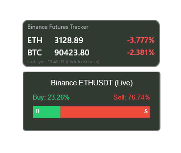

# Binance-ETH-RainMeter-Trackers

A sleek, lightweight Rainmeter skin that visualizes the real-time Buy/Sell ratio for ETH/USDT directly from the Binance Futures API.

## 📺 Preview

## 📊 Features
- **Live Data:** Fetches real-time order book depth from Binance.
- **Visual Ratio Bar:** Dynamic progress bar showing the balance between Bulls (Buy) and Bears (Sell).
- **Auto-Update:** Refreshes automatically to show market sentiment shifts.

## 🚀 Installation
1. **Requirement:** Ensure you have the latest version of [Rainmeter](https://www.rainmeter.net/) installed.
2. **Download:** Go to the [Releases](../../releases) section of this repository and download the `.rmskin` file.
3. **Install:** Double-click the `.rmskin` file and click "Install".
4. **Refresh:** The skin should appear on your desktop automatically.

## 🛠️ Configuration
If you want to change the update frequency or colors:
1. Right-click the skin and select **"Edit Skin"**.
2. Under the `[Variables]` section, you can modify:
   - `Width`: Adjust the width of the tracker.
   - `ColorBuy` / `ColorSell`: Change the hex/RGB values to match your desktop theme.
   - `UpdateRate`: Change how often it polls the API (Default is 1).

## 📄 License
Distributed under the **GNU General Public License v3.0**. See `LICENSE` for more information. 
This means you are free to modify and redistribute this skin, provided that the resulting work is also kept open-source under the same license.

## 🤝 Credits
- Data provided by [Binance Public API](https://binance-docs.github.io/apidocs/futures/en/).
- Developed by **Jaideep Mahay**.

---
*Disclaimer: This tool is for informational purposes only. It is not financial advice.*
